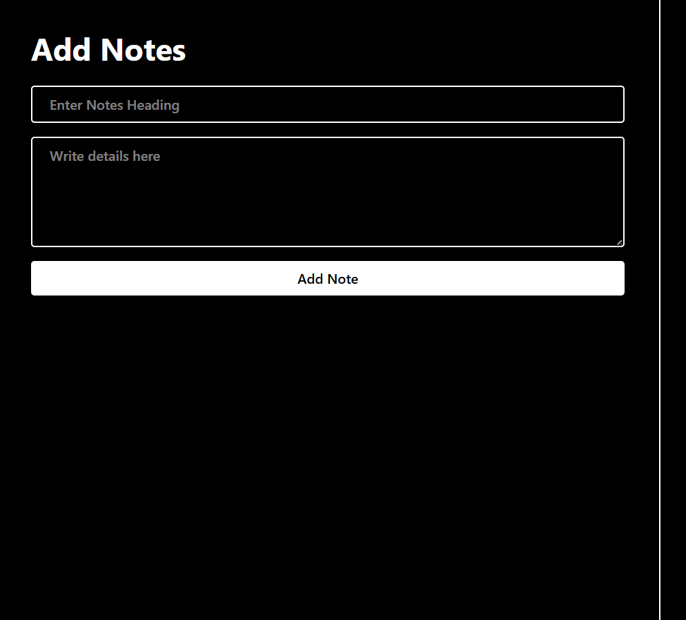
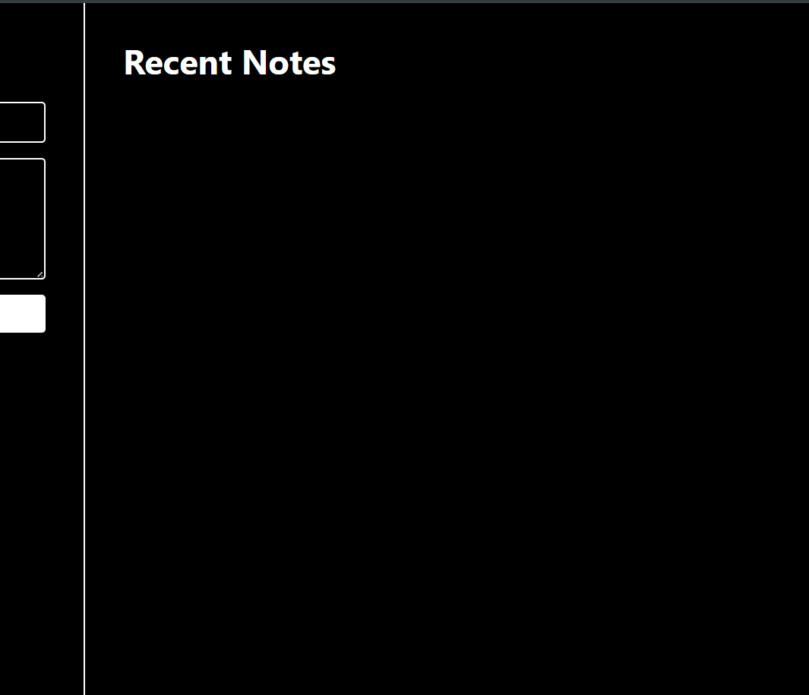
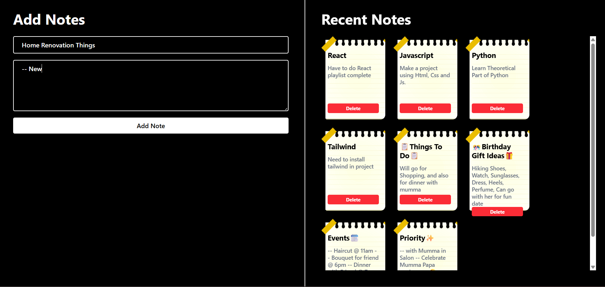
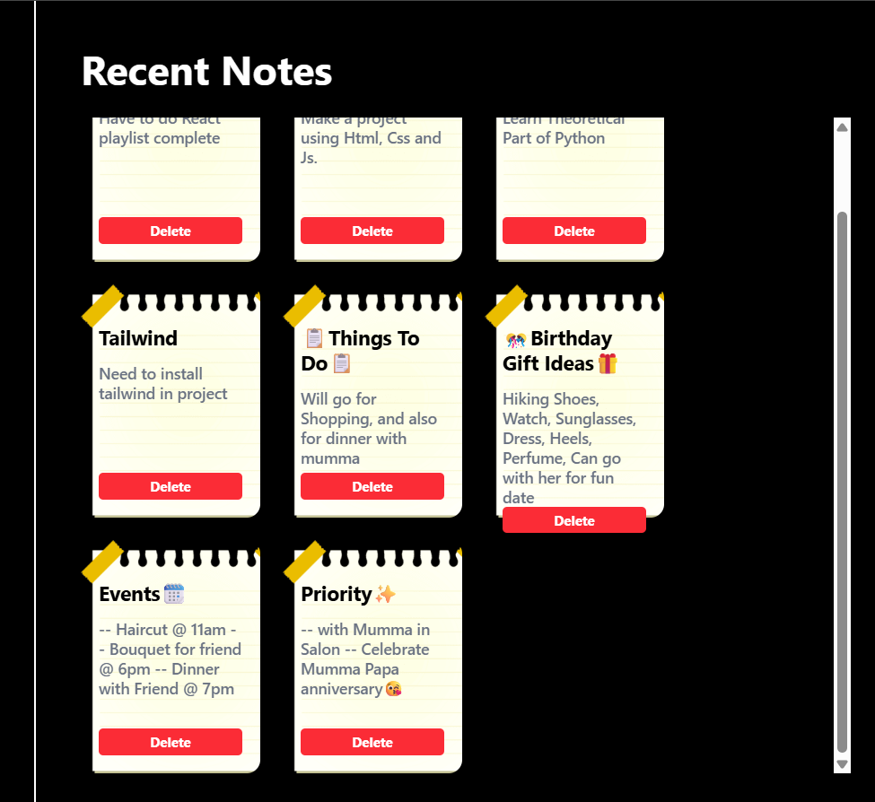

## Notes_APP

# About
Notes management web application, using the framework of ⚛️ React and the design library of 🎨 Tailwind CSS.
This project allows users to create, manage, and delete notes dynamically through a clean and responsive user interface.

The notes management application is all about creating components, state management with the help of React hooks, rendering, and designing a dynamic interface.


# 🚀 Features
``` text

📝 Create Notes Dynamically
🗑️ Delete Notes Instantly
⚡ Real-Time UI Updates
🎨 Modern Sticky Notes Design
⚛️ React Hooks State Management
♻️ Dynamic Rendering using .map()
✨ Interactive User Experience
💨 Tailwind CSS Styling
🧩 Clean and Readable Code Structure
```


# 🛠️ Tech Stack


# Screenshots

<p>


</p>

<p>

</p>

<p>

</p>


# 📂 Folder Structure

``` text

Notes_Project/
│
├── src/
│   │
│   ├── App.jsx
│   ├── main.jsx
│   └── index.css
│
├── public/
│
├── package.json
├── vite.config.js
└── README.md
```


# 🧠 Project Workflow

📌 Add Notes
``` text
Users can create notes by entering:

Note Title
Note Details
```
The note is dynamically stored inside React state using useState().


# 🎯 Project Objective

The main objective of this project is to improve frontend development skills by implementing:

``` text
State Management
Event Handling
Dynamic Rendering
Array Manipulation
Form Handling
Responsive UI Design

This project demonstrates practical React concepts used in real-world applications.
```